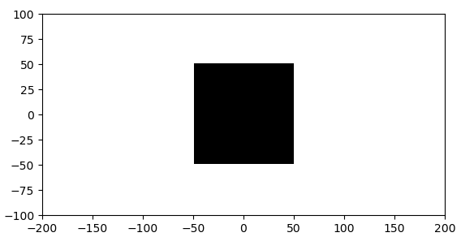
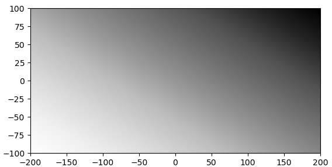
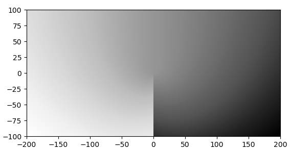
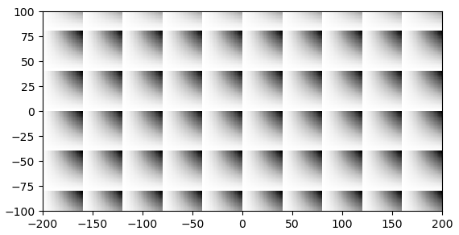
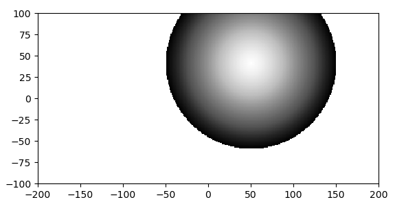
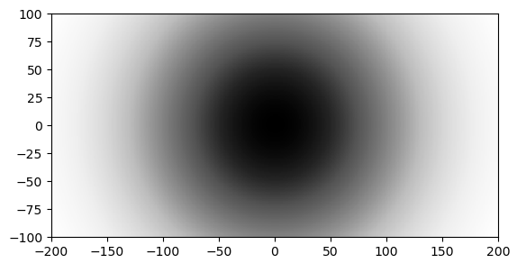
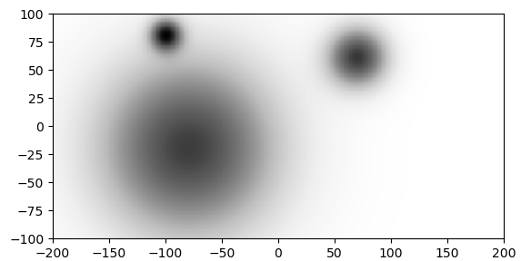
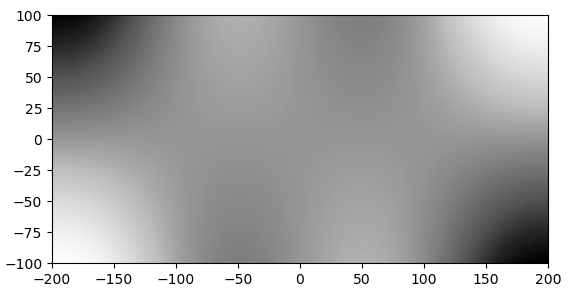
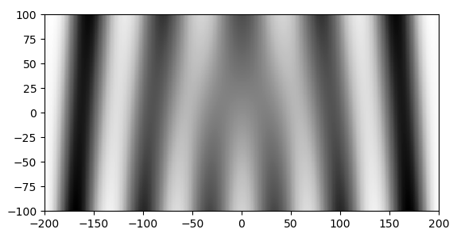
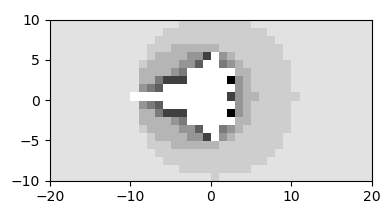

# Crazy Matrix
Allows the creation of visualization using combined mathematical expressions using each pixels coordinates as arguments.

## Install
### Create a conda environment
```bash
conda init bash # => Open new terminal
conda create --name crazy_matrix python=3.7
conda install --name crazy_matrix numpy
conda install --name crazy_matrix uuid
conda install --name crazy_matrix tk
conda install --name crazy_matrix matplotlib #xxx entfernen?
conda install --name crazy_matrix PyYAML
conda install --name crazy_matrix -c conda-forge pykwalify
```

### Activate the conda environment and start the program
```bash
cd crazy_matrix/
conda activate crazy_matrix
python main.py
```

## Here are some screenshots on what is possible:





















### Naming convention of file extensions
* cmc = crazy matrix circuit
* cmb = crazy matrix black (box)
* cmr = crazy matrix repeat (box)